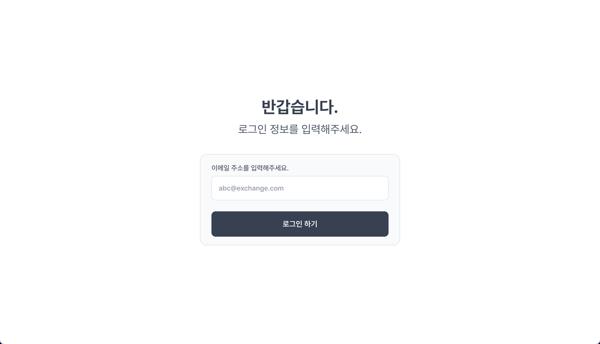
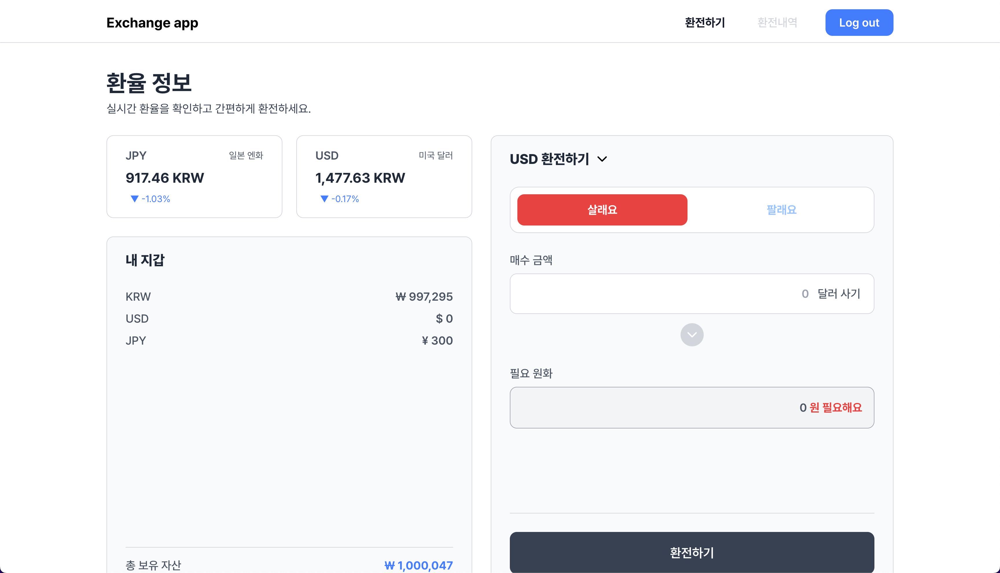
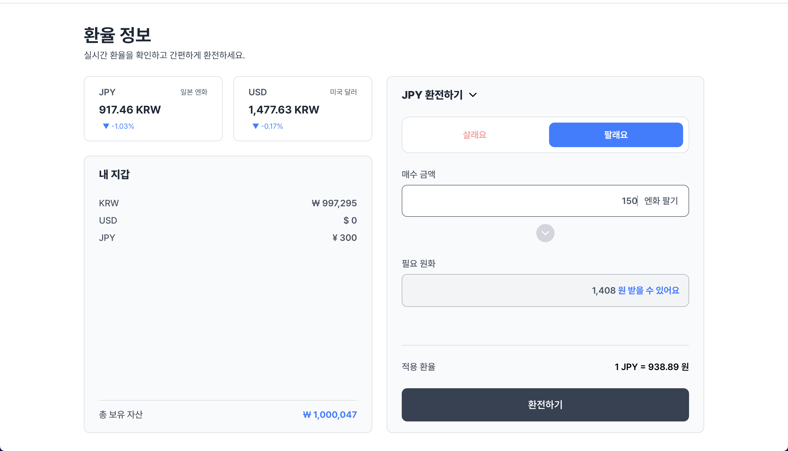
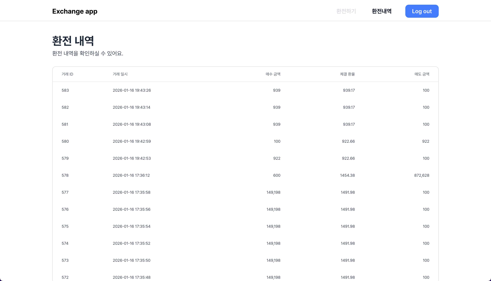

## 환전 애플리케이션

React + Next.js(App Router) 기반으로 환전 웹 애플리케이션을 구현했습니다.  
이메일 로그인, 실시간 환율 조회, 환전 실행, 환전 내역 조회까지 포함합니다.

---

## 구현 내용

### ✅ 사용자 인증

- 이메일 로그인 및 토큰 저장 (HttpOnly Cookie)
- 로그아웃 및 로그인 보호 라우팅

### ✅ 환전 기능

- 지갑 잔액/보유 자산 조회
- 실시간 환율 조회 및 1분 주기 갱신
- 환전 견적 조회
- 환전 실행 후 지갑/내역 자동 갱신

### ✅ 환전 내역

- 환전 내역 리스트 조회

---

## 화면 미리보기

- ### 로그인 화면

  

- ### 메인 화면(매수)

  

- ### 메인 화면(매도)

  

- ### 환전 내역 화면
  

---

## 사용 기술 및 라이브러리

- React 19, Next.js 16 (App Router)
- TypeScript
- @tanstack/react-query
- zustand
- tailwindcss
- lucide-react
- react-toastify

---

## 환경 변수

프로젝트 루트에 `.env` 파일이 필요합니다.

```bash
API_SERVER_URL=https://api-server-url.com
```

---

## 실행 방법

```bash
# 의존성 설치
npm install

# 개발 서버 실행
npm run dev
```

브라우저에서 [http://localhost:3000](http://localhost:3000)으로 접속합니다.

---

## 라우팅 구성

- `/login` : 로그인 페이지
- `/` : 환전 메인 페이지 (지갑, 환율, 환전 실행)
- `/orders` : 환전 내역 페이지

---

## API 호출 구조 (BFF)

Next.js API Route를 통해 API 요청을 우회합니다.

- 클라이언트 → `/api/*` (BFF)
- BFF → `API_SERVER_URL` (Backend)

토큰은 `HttpOnly` 쿠키로 저장되며, BFF에서 쿠키를 읽어 백엔드 요청에 Bearer 토큰을 붙입니다.

---

## 디렉토리 구조

```
app/
  (auth)/login           # 로그인 페이지
  (service)/page.tsx     # 환전 메인 페이지
  (service)/orders       # 환전 내역 페이지
  api/                   # BFF API 라우트
src/
  components/            # 공용 UI 컴포넌트
  features/
    auth/                # 인증 인가 관련 기능
    exchange-rate/       # 환율 관련 기능
    order/               # 주문 관련 기능
    wallet/              # 자산 관련 기능
  shared/                # 공통 유틸/에러/데이터 모델
  styles/                # 전역 스타일
```
